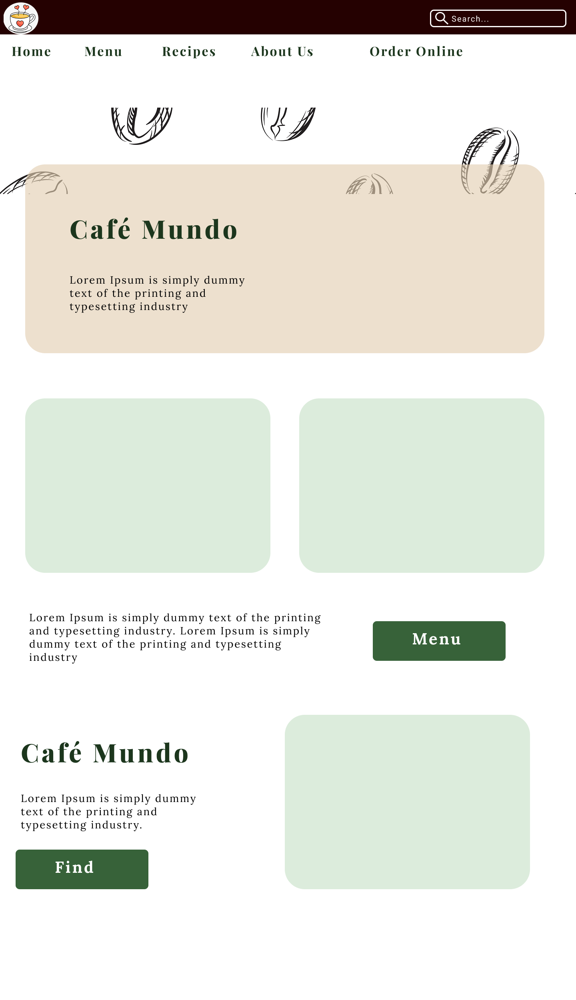

# ☕️ Café Mundo – Coffee, Recipes & Ordering

Café Mundo is a fullstack web application that lets users browse, rate, and comment on coffee recipes – and soon, order them online. Built with a strong focus on user experience, responsive design, and clean architecture. Currently being redesigned with a fresh look and new features.

---

## 🔍 Overview

Café Mundo allows users to:
- Browse a curated menu of coffee recipes
- Rate and comment on each recipe
- Read about coffee origins and brewing techniques
- Place online orders (in progress)
- Enjoy a responsive experience across devices

---

## 🎨 Design & UX

The app is being redesigned in Figma with the following pages:
- **Home** – welcoming hero section and highlights
- **Menu** – browse coffee recipes with ratings
- **Recipe** – detailed view with ingredients, steps, and comments
- **About** – learn more about the café and coffee culture
- **Order Online** – new section for e-commerce functionality
- Both **desktop** and **mobile** views

> 💡 Designed with accessibility, simplicity, and warmth in mind.

---

## 🔐 Features

- 📝 Rate & comment on recipes (user-generated content)
- 🛒 E-commerce module in development (shopping cart & checkout)
- 🔄 Full CRUD via REST API
- 📱 Fully responsive interface

---

## 🧠 What I'm Learning

- Refactoring and scaling fullstack apps
- Designing mobile-first UIs in Figma
- Structuring clean API endpoints with better separation of concerns
- Preparing the app for future production-readiness and secure data flow

---

## 🛠 Tech Stack

**Frontend:** React · TypeScript · Styled Components  
**Backend:** Node.js · Express · MongoDB  
**Design:** Figma  
**Auth (upcoming):** JWT · Cookies or OAuth  
**Hosting:** Coming soon  

---

## 📸 UI Previews
> **Note:** These screenshots show selected views from the full Café Mundo app. Additional features like recipe details, user ratings, commenting, and online ordering are included but not shown here.

### 🏠 Café Mundo Home

### ☕️ Café Mundo Product Page

### 📲 Café Mundo Home Mobile View

---

## 🚧 Status

The original recipe-only version is being rebuilt to support online ordering and better mobile experience.  
**Current focus:** UI redesign + refactoring backend for new e-commerce features.

---

## 📬 Contact

Have feedback, ideas, or questions?  
Feel free to reach out or follow the rebuild journey!

---
